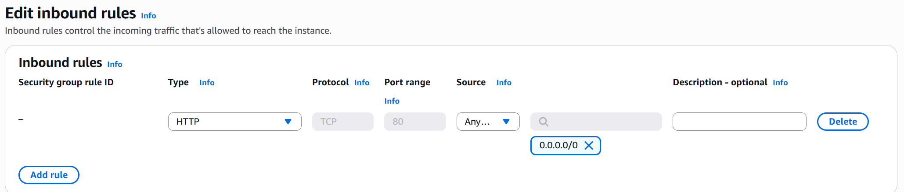
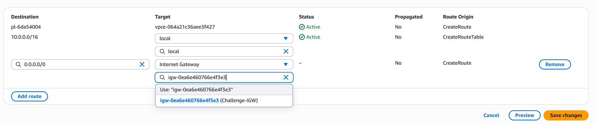

Deployed intentionally broken AWS infrastructure via CloudFormation, then investigated and fixed VPC networking issues to get a web server back online.

<!--more-->

## Project Overview

**Goal**: Deploy a deliberately misconfigured AWS environment and diagnose why an EC2 web server was unreachable from the internet — then fix it.

**Scenario**: A startup developer set up a simple web server in a new VPC to validate their setup before building an MVP. When they tried to access it via the EC2 instance's public IP, the connection timed out. My job was to find out why and fix it.

**Services Used**:
- **CloudFormation** -- Deployed the broken infrastructure stack from a template
- **VPC** -- The virtual network containing all resources
- **EC2** -- The web server instance hosting a static page
- **Security Groups** -- Firewall rules controlling inbound/outbound traffic
- **Route Tables** -- Rules determining how network traffic is directed

## Architecture

```text
Internet
   │
   ▼
Internet Gateway
   │
   ▼
Public Route Table ──► Public Subnet
                          │
                          ▼
                    Security Group ──► EC2 Instance (Web Server, Port 80)
```

## The Challenge

The connection timed out when accessing the web server via its public IP. That told me the issue was somewhere in the network path between the internet and the EC2 instance. In AWS, traffic has to pass through several layers to reach an instance:

1. **Internet Gateway** — attached to the VPC
2. **Route Table** — must have a route sending `0.0.0.0/0` traffic to the Internet Gateway
3. **Security Group** — must allow inbound traffic on the correct port
4. **EC2 Instance** — must be in a public subnet with a public IP

Any one of these being misconfigured would cause a timeout.

## Implementation

### Step 1: Deploy the Broken Infrastructure

Ran the CloudFormation template in AWS CloudShell to spin up the intentionally broken environment:

```bash
aws cloudformation create-stack \
  --stack-name TheCloudClub-Day1 \
  --capabilities "CAPABILITY_IAM" \
  --template-url https://assets-thecloudclub-community.s3.us-east-1.amazonaws.com/aws/c000-c4c86cb.yaml

aws cloudformation wait stack-create-complete --stack-name TheCloudClub-Day1
```

This created a VPC, subnet, EC2 instance, and associated networking — with deliberate misconfigurations baked in.

### Step 2: Check Security Groups

Opened the EC2 console and checked the inbound rules on the instance's security group. The security group had **no inbound rule allowing HTTP traffic on port 80**.

**Fix**: Added an inbound rule:
- **Type**: HTTP
- **Port**: 80
- **Source**: `0.0.0.0/0` (anywhere)



### Step 3: Check the VPC

Opened the VPC console and reviewed the general settings for `Challenge-VPC`. Verified the Internet Gateway was attached — it was.

### Step 4: Check the Route Table

Opened the route table associated with the public subnet. The route table was **missing the default route to the Internet Gateway**.

**Fix**: Added a route:
- **Destination**: `0.0.0.0/0`
- **Target**: Internet Gateway (`igw-xxxxx`)



### Step 5: Validate the Fix

Ran the validation Lambda function to confirm the challenge was solved:

```bash
aws lambda invoke \
  --function-name TheCloudClubDay1Validation \
  --output json output.json > /dev/null \
  && jq -r '.body | fromjson | .message' output.json
```

Result: **Challenge solved!**

### Step 6: Clean Up

Deleted the CloudFormation stack to avoid charges:

```bash
aws cloudformation delete-stack --stack-name TheCloudClub-Day1
aws cloudformation wait stack-delete-complete --stack-name TheCloudClub-Day1
```

## Challenges and Solutions

| Problem | Root Cause | Fix |
|---------|-----------|-----|
| Connection timeout on port 80 | Security group missing HTTP inbound rule | Added inbound rule allowing TCP port 80 from `0.0.0.0/0` |
| Still timing out after SG fix | Route table missing internet route | Added `0.0.0.0/0` route pointing to the Internet Gateway |

The key insight was that **both** issues needed fixing. Fixing just the security group wasn't enough — without the route table entry, traffic had no path to reach the instance even if the firewall allowed it.

## What I Learned

- **Troubleshoot layer by layer**: When an EC2 instance is unreachable, work through the network path systematically — Internet Gateway, route tables, NACLs, security groups, then the instance itself.
- **Security groups vs route tables**: Security groups control *what's allowed*, route tables control *where traffic goes*. Both must be correct.
- **CloudFormation for learning**: Using CloudFormation to deploy intentionally broken infrastructure is a great way to practice debugging without risk to real environments.
- **Multiple failures are common**: Real-world issues often involve more than one misconfiguration. Don't stop investigating after finding the first problem.

## Cost Breakdown

| Service | Cost |
|---------|------|
| EC2 (t2.micro, ~30 min) | Free tier |
| VPC / Networking | Free |
| CloudFormation | Free |
| Lambda (validation) | Free tier |
| **Total** | **$0.00** |

## Next Steps

- Explore more complex VPC setups with public and private subnets
- Learn about NACLs (Network Access Control Lists) as an additional security layer
- Practice setting up VPC peering and Transit Gateway
